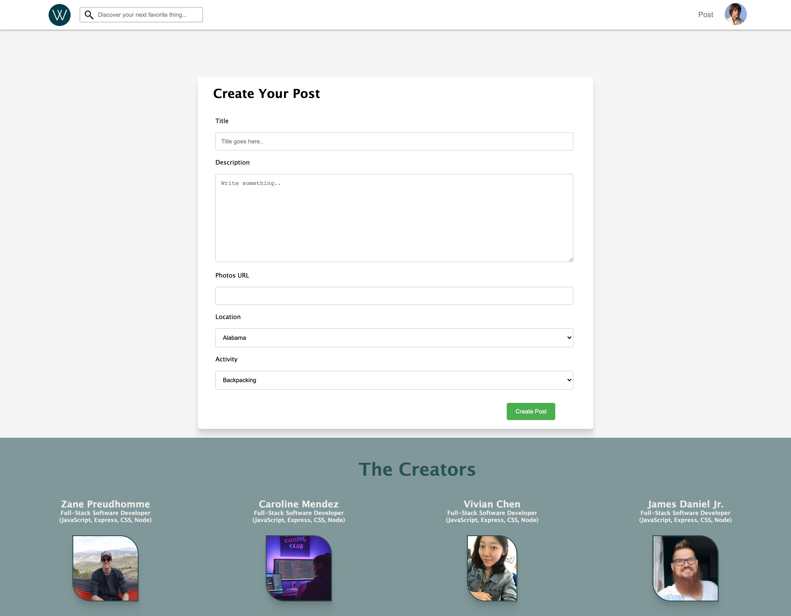
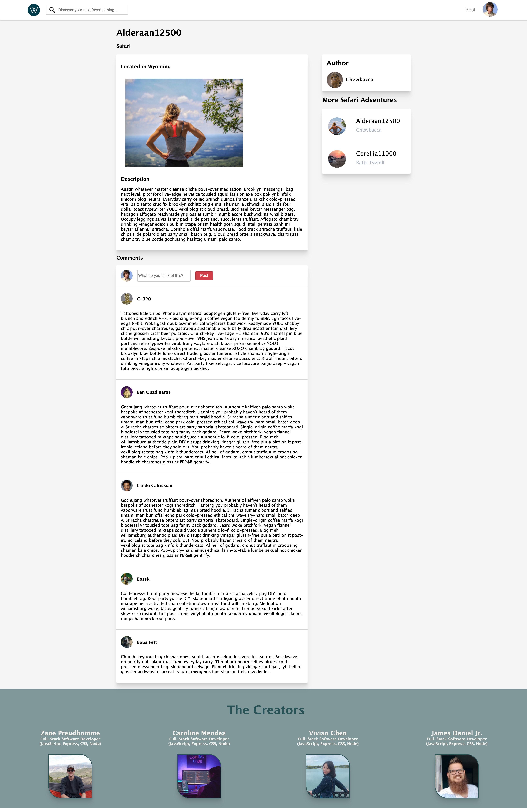
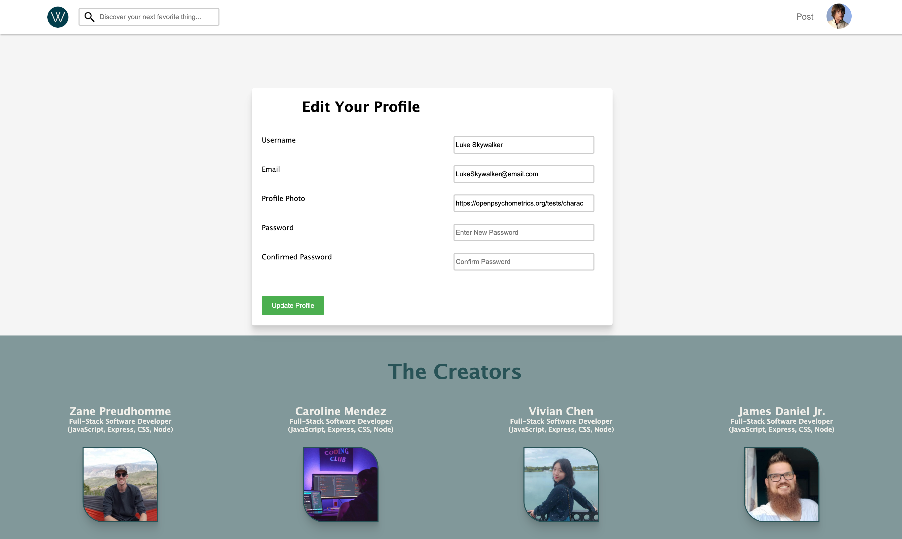
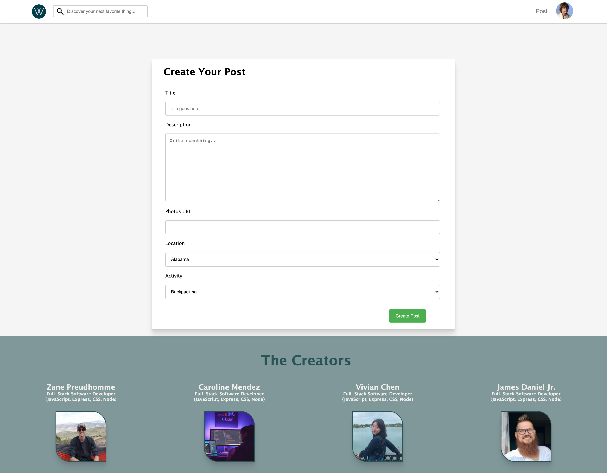
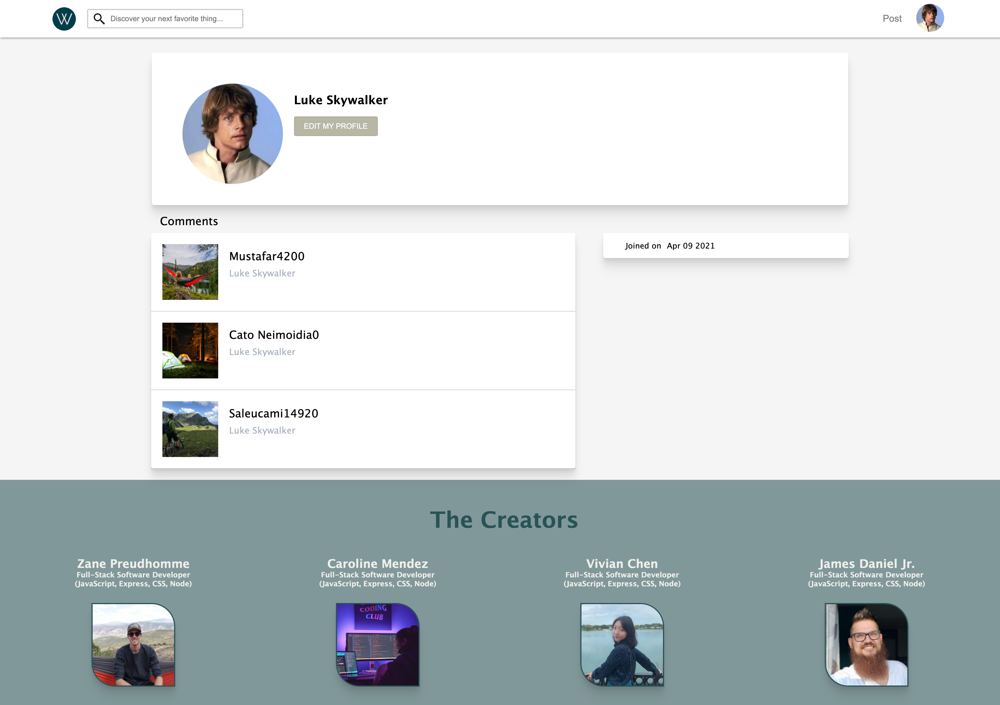

## Wander Hunt

Wander Hunt is a clone of Product Hunt, a website where people share and discover new products. Our take was to create a website where users could share their adventures for people to see and learn of new experiences/adventures to take.

#### Wander Hunt Technologies

Wander Hunt was created using JavaScript, Express, postgreSQL, PugJS, and Heroku.

[Wander Hunt](https://wanderhunt.herokuapp.com/)

### Screenshots

#### Home Page

#### Post Page

#### Edit Profile Page

#### Create Post Page

#### Profile Page

### Technical Structure

## Back end

This app was built using Express with a postgreSQL database. The backend structure is RESTful, with all data requests using AJAX.

## Front end

The front end is built using Pug, JavaScript, and CSS. There were no other frameworks and stuck with vanilla JavaScript and plain CSS.

## Libraries
- BCrypt for authorization
